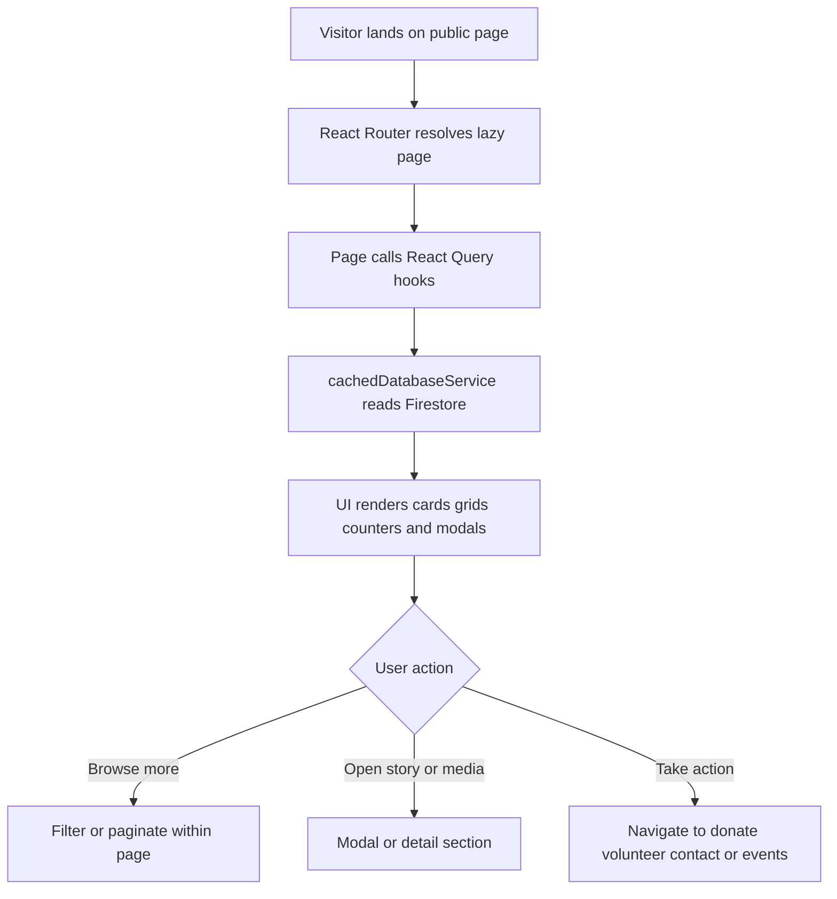

# Module 1 Public Information and Storytelling

Version: 1.0
Date: 2026-03-09
Creator: GitHub Copilot
Reviewer: TBD
Organization: Educare Dada Chi Shala Educational Trust

## 1. Overview

Business purpose

This module presents the public identity of Dada Chi Shala. It helps visitors understand the mission, see impact, browse media, read stories, and build trust before deciding to volunteer, donate, or contact the organization.

What this module does

- Renders the homepage and public information pages.
- Displays achievements, stories, media, team highlights, and selected upcoming events.
- Shows testimonials, blogs, awards, and news.
- Uses SEO metadata and structured data for discoverability.
- Reads content from Firestore through shared query hooks and cached services.

When it runs

- On navigation to /, /about, /gallery, /team, and /media.
- On initial app load when the requested page is lazy loaded.
- When users switch categories, open content modals, or React Query refetches data.

## 2. Business and Process Detail

Business overview

This is the public storefront of the NGO. It is designed for discovery and trust building. Public users mainly read data. Content freshness depends on records maintained by admins in Firestore.

Process flow

Detailed journey

1. A visitor enters a public route from a direct URL, search engine, or internal navigation.
2. App.jsx resolves the route and lazy loads the page.
3. The page calls hooks such as useUpcomingEvents, useGalleryItems, useBlogs, useSuccessStories, useTestimonials, and useTeamMembers.
4. The hook delegates to cachedDatabaseService.js, which reads Firestore and returns normalized arrays.
5. The UI renders cards, counters, carousels, previews, and media grids.
6. The visitor may open a modal, switch a category filter, or navigate deeper.
7. If the visitor wants to act, they continue to donation, volunteer, contact, or events flows.

Functional requirements

- FR-PS-01: Public landing and information pages must load without authentication unless maintenance mode is active.
- FR-PS-02: Gallery, stories, testimonials, blogs, awards, and media must render from Firestore data.
- FR-PS-03: A subset of upcoming events must be shown in ascending event date order.
- FR-PS-04: Gallery and media pages must support category based filtering.
- FR-PS-05: Public pages must render SEO metadata and structured data where configured.

Non functional requirements

- Public pages should lazy load so admin code is not downloaded up front.
- React Query should refetch on mount, reconnect, and window focus.
- The application should continue working even if analytics initialization fails.
- Firestore query patterns should support date and timestamp ordering.
- Public pages should work across desktop and mobile layouts.

Technical breakdown

Main files

- src/pages/HomePage.jsx
- src/pages/AboutPage.jsx
- src/pages/GalleryPage.jsx
- src/pages/TeamPage.jsx
- src/pages/MediaPage.jsx

Primary child components

- src/components/AnimatedCounter.jsx
- src/components/BlogCard.jsx
- src/components/BlogModal.jsx
- src/components/EventCard.jsx
- src/components/GalleryGrid.jsx
- src/components/gallery/GalleryItemCard.jsx
- src/components/stories/StoryTestimonialCard.jsx
- src/components/team/TeamMemberCard.jsx
- src/components/SEO.jsx

Supporting dependencies

- src/hooks/useFirebaseQueries.js
- src/services/cachedDatabaseService.js
- src/services/cacheService.js
- src/utils/formatters.js
- src/utils/helpers.js
- src/utils/colorUtils.js
- src/config/queryClient.jsx

Runtime notes

- Public pages read through React Query hooks.
- SEO.jsx injects metadata on render.
- AnimatedCounter.jsx runs when counters enter the viewport.

Imported function groups

- Hooks such as useUpcomingEvents, useGalleryItems, useBlogs, useSuccessStories, and useTestimonials.
- Service methods such as getGalleryItems, getBlogs, getSuccessStories, getTestimonials, getAwards, getNewsArticles, and getVideos.
- Formatting helpers for safe display.

Security considerations

- This module is public and must not depend on admin authentication.
- Content should be sanitized before storage.
- SEO metadata must not expose secrets or internal admin URLs.
- Media assets should come from Firebase Storage or trusted external URLs.

Performance considerations

- Route level lazy loading reduces initial bundle size.
- React Query caches repeated reads and refetches on visibility changes.
- Recent first query patterns support browsing well.
- Image heavy pages remain sensitive to media size and storage optimization.

## 3. Data and Automation

Read operations

- gallery
- successStories
- testimonials
- blogs
- awards
- news
- videos
- events
- team

Records created

This module does not normally create records. Content is created through admin modules.

## 4. Impacted Components

Direct page files

- src/pages/HomePage.jsx
- src/pages/AboutPage.jsx
- src/pages/GalleryPage.jsx
- src/pages/TeamPage.jsx
- src/pages/MediaPage.jsx

Shared UI files

- src/components/AnimatedCounter.jsx
- src/components/BlogCard.jsx
- src/components/BlogModal.jsx
- src/components/EventCard.jsx
- src/components/GalleryGrid.jsx
- src/components/gallery/GalleryItemCard.jsx
- src/components/stories/StoryTestimonialCard.jsx
- src/components/team/TeamMemberCard.jsx
- src/components/Navbar.jsx
- src/components/Footer.jsx
- src/components/SEO.jsx

Supporting service and hook files

- src/hooks/useFirebaseQueries.js
- src/services/cachedDatabaseService.js
- src/services/cacheService.js
- src/config/queryClient.jsx
- src/App.jsx

Impact notes

- Schema changes affect public pages after query refresh.
- Changes to shared cards and modals can affect multiple pages.
- Cache TTL changes affect perceived freshness and Firestore read volume.
- SEO or routing changes affect discoverability and entry traffic.

## 5. Admin and Technical Notes

Configuration requirements

- Firebase environment variables must be present in .env.
- Storage URLs for images must remain valid.
- Query indexes may be required for ordered public feeds.

Permissions needed

- Public read access for approved content collections.
- Admin write access only in content management modules.

Debug queries

- gallery ordered by uploaded_at desc
- events filtered by event_date greater than or equal to today and ordered by event_date asc
- blogs ordered by created_at desc
- team ordered by order asc

Common issues

- Empty sections because Firestore data is missing.
- Broken images because storage URLs are invalid.
- Incorrect ordering because timestamps or fields are missing.
- Stale public content because cache has not been invalidated yet.

Troubleshooting

1. Confirm Firebase environment variables are valid.
2. Check browser console for Firestore permission or index errors.
3. Validate that documents contain expected fields such as created_at, uploaded_at, category, and order.
4. Clear local cache through cacheService.clearAll() or hard refresh.
5. Confirm the admin module published content to the expected collection.
