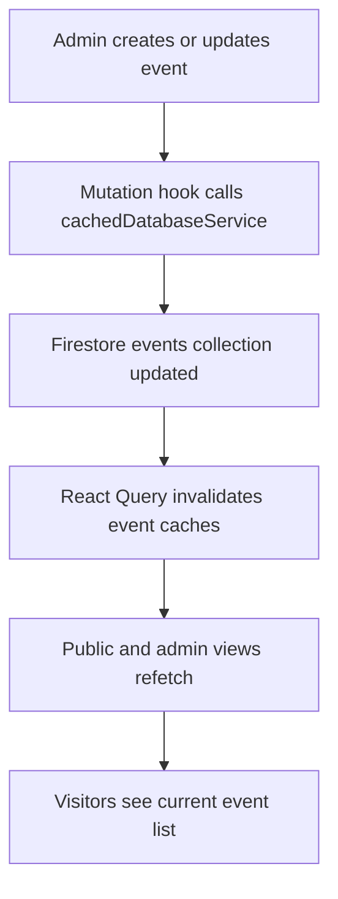

# Module 2 Events Management

Version: 1.0
Date: 2026-03-09
Creator: GitHub Copilot
Reviewer: TBD
Organization: Educare Dada Chi Shala Educational Trust

## 1. Overview

Business purpose

This module helps the organization promote upcoming programs and keep the community informed about scheduled activities. It supports both public event discovery and admin maintenance of the event calendar.

What this module does

- Lists events for public users.
- Shows upcoming events on the homepage and events page.
- Allows admins to create, edit, and delete event records.
- Uses shared query hooks and cache invalidation to keep data current.

When it runs

- On navigation to /events.
- On homepage rendering when upcoming events are requested.
- On admin dashboard access to the Events tab.
- On every event create, update, and delete action by an authenticated admin.

## 2. Business and Process Detail

Business overview

Events are a program delivery and engagement mechanism. The same data set is used for both public awareness and internal management.

Process flow

Detailed journey

1. An admin opens the Events tab in the dashboard.
2. EventManagement.jsx renders records using useEvents().
3. The admin opens EventForm.jsx for create or update.
4. Form submission calls useAddEvent() or useUpdateEvent().
5. cachedDatabaseService.js writes to the events collection and stamps timestamps.
6. Query caches for events and upcomingEvents are invalidated.
7. Public pages refetch and display updated event cards in ascending event date order.
8. A public visitor browsing /events or the homepage sees the refreshed schedule.

Functional requirements

- FR-EV-01: The system must list all event records for public users in ascending event_date order.
- FR-EV-02: The system must show upcoming events separately. The default upcoming limit is 3.
- FR-EV-03: Admin users must be able to create new events. created_at and updated_at are stamped on create.
- FR-EV-04: Admin users must be able to update events. updated_at is refreshed on modification.
- FR-EV-05: Admin users must be able to delete events. Current implementation uses hard delete.

Non functional requirements

- Event queries should remain lightweight and index backed.
- Failed mutations should surface errors without corrupting current UI state.
- Cache invalidation should refresh both full and upcoming event lists.
- Public listing and admin editing must use one shared schema.

Technical breakdown

Entry files

- src/pages/EventsPage.jsx
- src/components/EventManagement.jsx

Child files

- src/components/EventCard.jsx
- src/components/EventForm.jsx
- src/components/EventDetails.jsx

Supporting files

- src/hooks/useFirebaseQueries.js
- src/services/cachedDatabaseService.js
- src/services/cacheService.js
- src/utils/helpers.js
- src/utils/validators.js
- src/components/common

Hooks used

- useEvents(limitCount)
- useUpcomingEvents(limitCount)
- useAddEvent()
- useUpdateEvent()
- useDeleteEvent()

Underlying service methods

- getEvents()
- getUpcomingEvents()
- addEvent()
- updateEvent()
- deleteEvent()

Security considerations

- Public event reading is open by design.
- Event creation, update, and deletion must remain admin only.
- Firestore rules must enforce write protection.

Performance considerations

- getUpcomingEvents() uses event_date filtering and ordering, so a Firestore index may be required.
- Event cache invalidation is targeted and efficient.
- Admin updates should scale well unless richer event features are added later.

## 3. Data and Automation

Read and write operations

- Read events ordered by event_date asc.
- Read upcoming events filtered by current date.
- Insert events documents.
- Update events documents.
- Delete events documents.

Key fields

- event_date
- created_at
- updated_at
- title and description fields used by the UI

Records created

No child collections are created by the event flow. Query invalidation of events and upcomingEvents acts as follow on automation.

## 4. Impacted Components

Direct files

- src/pages/EventsPage.jsx
- src/components/EventManagement.jsx
- src/components/EventForm.jsx
- src/components/EventCard.jsx
- src/components/EventDetails.jsx

Indirect files

- src/pages/HomePage.jsx
- src/hooks/useFirebaseQueries.js
- src/services/cachedDatabaseService.js
- src/services/cacheService.js
- src/pages/AdminDashboard.jsx
- src/components/ProtectedRoute.jsx
- src/config/queryClient.jsx

Impact notes

- Schema changes in events affect both public and admin views.
- Changes to hook names or query keys affect invalidation logic.
- Homepage regressions can occur if upcoming event logic changes or returns empty data.
- Event date formatting or validation changes affect both forms and public display.

## 5. Admin and Technical Notes

Configuration requirements

- Firestore collection events must exist.
- Query indexes must support the where plus orderBy combination for upcoming events.

Permissions needed

- Public read access for published event data.
- Authenticated admin write access for create, update, and delete operations.

Debug queries

- events orderBy event_date asc
- events where event_date greater than or equal to today orderBy event_date asc limit 3

Common issues

- Missing Firestore index for upcoming event queries.
- Empty public listing caused by incorrectly formatted event_date values.
- Admin save succeeds but data appears stale because refetch has not completed yet.

Troubleshooting

1. Confirm documents in events contain parsable event_date values.
2. Verify Firestore index support for the filter and order combination.
3. Confirm the admin user reaches the dashboard through authenticated routing.
4. Check that query invalidation runs after mutations.
5. Hard refresh the app if stale local cache is suspected.
