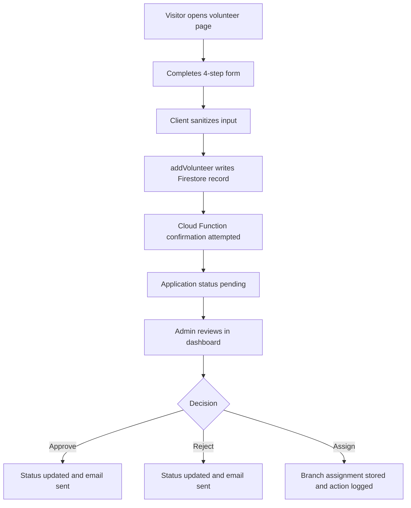

# Module 3 Community Engagement Volunteers and Branches

Version: 1.0
Date: 2026-03-09
Creator: GitHub Copilot
Reviewer: TBD
Organization: Educare Dada Chi Shala Educational Trust

## 1. Overview

Business purpose

This module converts interested visitors into active contributors. It allows people to volunteer, understand branch locations, and gives administrators tools to review applications, communicate decisions, and assign volunteers to branches.

What this module does

- Captures volunteer applications through a four step public form.
- Shows branch information for public visitors.
- Stores volunteer records in Firestore.
- Supports review, approval, rejection, assignment, and action history logging for admins.
- Sends volunteer related notifications through EmailJS and Firebase Functions.

When it runs

- On navigation to /volunteer and /branches.
- When a visitor moves through the volunteer form.
- When admins open the Volunteers or Branches tabs in the dashboard.
- When admins change status or branch assignment.

## 2. Business and Process Detail

Business overview

The business goal is to bring volunteers into the organization in a structured way while keeping branch data visible and manageable.

Process flow

Detailed journey

1. A public user visits /volunteer.
2. The UI collects personal information, skills, preferences, availability, and motivation across four steps.
3. Required fields are validated and key text inputs are sanitized.
4. addVolunteer() writes a structured Firestore document into volunteers.
5. The page attempts to call sendVolunteerConfirmation.
6. The user receives a success or failure message in the UI.
7. An admin later opens VolunteerManagement.jsx in the dashboard.
8. The admin reviews submissions by status, updates the decision, and can assign a branch.
9. Additional actions are appended to action_history and notifications are triggered.
10. Branch records in branches support browsing and assignment decisions.

Functional requirements

- FR-CE-01: Public users must be able to submit volunteer applications through a four step form.
- FR-CE-02: Volunteer records must store personal_info, skills_and_interests, availability, experience_and_motivation, and references_and_emergency.
- FR-CE-03: Admins must be able to review volunteer applications by status.
- FR-CE-04: Admins must be able to assign a branch and store coordinator information with action history.
- FR-CE-05: Visitors must be able to browse branch information.

Non functional requirements

- Personal volunteer data must remain limited to admin visible workflows.
- Email failures must not block a successful application submission.
- Multi step navigation must preserve entered state.
- Volunteer and branch lists should refresh quickly after admin actions.
- Volunteer and branch logic should remain separable even though they are documented together.

Technical breakdown

Public entry files

- src/pages/VolunteerPage.jsx
- src/pages/BranchesPage.jsx

Admin entry files

- src/components/VolunteerManagement.jsx
- src/components/BranchManagement.jsx

Child and related files

- src/components/BranchCard.jsx
- src/components/common/FormInput.jsx
- src/components/common/Modal.jsx
- src/components/common/Button.jsx
- src/components/ImageUpload.jsx

Supporting dependencies

- src/hooks/useFirebaseQueries.js
- src/services/cachedDatabaseService.js
- src/services/emailService.js
- src/services/imageUploadService.js
- src/services/firebase.js
- src/utils/validators.js
- src/utils/sanitization.js
- functions/index.js

Key hooks and functions

- useVolunteers()
- useVolunteersByStatus(status)
- useBranches()
- useAddBranch()
- useUpdateBranch()
- useDeleteBranch()
- addVolunteer()
- updateVolunteerStatus()
- assignVolunteerToBranch()
- addVolunteerAction()
- sendVolunteerEmail()

Security considerations

- Volunteer submissions contain personal data and must be protected by Firestore rules.
- Admin review depends on route protection and should also be enforced by backend authorization.
- EmailJS client configuration should be governed carefully.
- Branch image uploads require secure Storage write rules.

Performance considerations

- Volunteer writes are lightweight single document inserts.
- Admin dashboards become heavier as record count and action_history arrays grow.
- Branch reads are inexpensive for public display.
- Email and function calls are asynchronous and non blocking where possible.

## 3. Data and Automation

Read and write operations

- Insert into volunteers.
- Read all volunteers.
- Read volunteers by application_status.
- Update volunteer status fields.
- Update volunteer branch assignment and coordinator email.
- Append volunteer action_history.
- Read branches.
- Insert, update, and delete branches.

Relevant structures

- Volunteer sub objects for personal info, skills, availability, experience, references, and emergency contacts.
- Branch metadata including name, location, timings, student count, team members, and image URL.

Records created

- action_history entries are appended inside volunteer records.
- Confirmation and status emails are triggered as automation.

## 4. Impacted Components

Direct files

- src/pages/VolunteerPage.jsx
- src/pages/BranchesPage.jsx
- src/components/VolunteerManagement.jsx
- src/components/BranchManagement.jsx
- src/components/BranchCard.jsx

Indirect files

- src/hooks/useFirebaseQueries.js
- src/services/cachedDatabaseService.js
- src/services/emailService.js
- src/services/imageUploadService.js
- src/services/firebase.js
- src/pages/AdminDashboard.jsx
- src/components/ProtectedRoute.jsx
- functions/index.js
- src/utils/validators.js
- src/utils/sanitization.js

Impact notes

- Volunteer schema changes affect public submission, admin review, and email templates.
- Branch schema changes affect public discovery and assignment workflows.
- Changes to email templates or function names can break communication without affecting data persistence.
- Storage upload changes can disrupt branch management without affecting volunteer submission logic.

## 5. Admin and Technical Notes

Configuration requirements

- Firebase Functions must be deployed for volunteer confirmation.
- EmailJS configuration must be valid.
- Firestore must allow intended paths under secure rules.
- Storage must accept branch image uploads for authorized users.

Permissions needed

- Public create access only where volunteer submissions are intentionally allowed.
- Restricted admin read and write access for volunteer review and branch maintenance.
- Storage write permission for admin image uploads.

Debug queries

- volunteers orderBy submitted_at desc
- volunteers where application_status equals status ordered by submitted_at desc
- branches orderBy branch_name asc

Common issues

- Volunteer submissions succeed but confirmation email fails.
- Firestore index is missing for volunteer status queries.
- Branch assignment updates one status field but not all dependent fields.
- Uploaded branch images fail because of Storage permissions or file constraints.

Troubleshooting

1. Confirm Firestore receives a volunteer record with nested objects and pending status.
2. Verify the callable function name exists and is deployed.
3. Review EmailJS service, template, and public key configuration.
4. Check Firestore rules and indexes for volunteer status filtering.
5. Validate uploaded files against image type and size rules.
