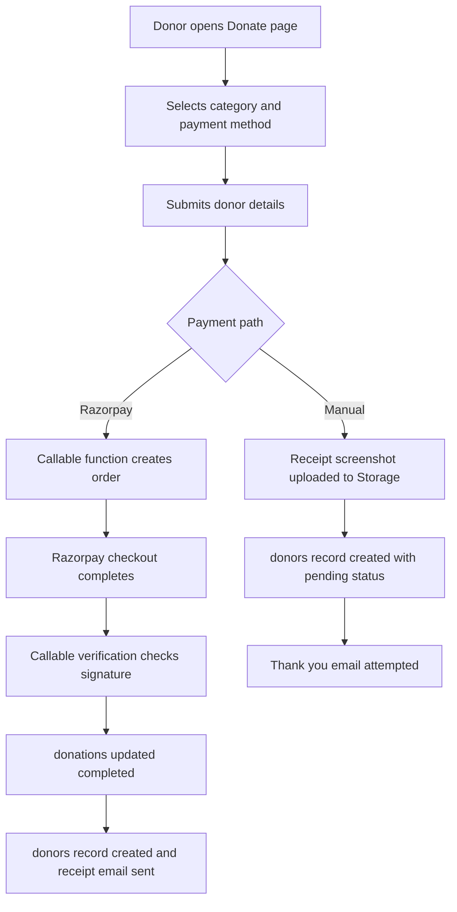

# Module 4 Donations and Fundraising

Version: 1.0
Date: 2026-03-09
Creator: GitHub Copilot
Reviewer: TBD
Organization: Educare Dada Chi Shala Educational Trust

## 1. Overview

Business purpose

This module converts goodwill into financial support. It provides donation options, collects donor information, processes online payments through Razorpay, accepts manual transfer evidence, and creates records for finance operations and donor communication.

What this module does

- Presents donation categories and payment options.
- Collects donor contact and tax related information.
- Supports Razorpay based online payments.
- Supports manual transfer flows with screenshot upload.
- Stores donation and donor data in Firestore.
- Uses Cloud Functions for order creation, payment verification, webhook processing, and receipt email delivery.

When it runs

- On navigation to /donate.
- When the Razorpay SDK is loaded.
- When a donor submits the form for online or manual payment.
- When Cloud Functions receive verification or webhook events.
- When admins open the Donations tab.

## 2. Business and Process Detail

Business overview

This is the revenue collection workflow of the application. It is the most integration heavy area because it spans frontend forms, file upload, payment gateway orchestration, Firestore persistence, webhook processing, and email receipts.

Process flow

Detailed journey

1. The donor opens /donate and chooses a funding category.
2. The page preselects an amount and allows online payment or manual transfer.
3. Donor information is collected through React Hook Form.
4. For Razorpay payments, the page ensures the gateway script is ready and calls initiatePayment().
5. createRazorpayOrder creates an order and stores a pending donations record.
6. verifyRazorpayPayment validates the HMAC signature and updates the pending record to completed.
7. The function creates a donors document and sends a receipt email.
8. razorpayWebhook can reconcile captured or failed payments.
9. For manual transfer, the user uploads a screenshot to Firebase Storage and a pending donors record is created from the frontend.
10. The donor sees a thank you screen after successful submission.

Functional requirements

- FR-DF-01: The system must present predefined donation categories with default amounts and frequencies.
- FR-DF-02: The system must support online payment through Razorpay and verify signatures before marking records complete.
- FR-DF-03: The system must support manual payment evidence upload with client side file validation.
- FR-DF-04: The system must store donor details with amount, category, and payment metadata.
- FR-DF-05: The system must attempt donor communication after submission or verification without invalidating successful payment records.

Non functional requirements

- Gateway secret keys must stay server side.
- Payment records must not be marked successful without valid verification.
- Webhook reconciliation should recover interrupted frontend flows.
- Donation flow should work on mobile and desktop.
- Payment and email failures should be logged.

Technical breakdown

Entry files

- src/pages/DonatePage.jsx
- src/components/DonationManagement.jsx

Supporting frontend files

- src/services/razorpayService.js
- src/services/emailService.js
- src/services/firebase.js
- src/services/cachedDatabaseService.js
- src/components/SEO.jsx
- src/utils/validators.js

Backend files

- functions/index.js
- functions/package.json

Frontend methods and hooks

- loadRazorpayScript()
- initiatePayment()
- handleRazorpayPayment()
- handleManualPayment()
- useDonations()
- useDonationStats()

Backend methods

- createRazorpayOrder
- verifyRazorpayPayment
- razorpayWebhook
- sendReceiptEmail()

Security considerations

- HMAC validation is implemented in Cloud Functions.
- Razorpay key secret and webhook secret remain server side.
- Donor data such as phone and PAN must be protected through strict Firestore rules and retention policies.
- Manual screenshot uploads must be restricted.
- Client side email configuration is not a secure audit mechanism.

Performance considerations

- Online payments depend on third party script load and network round trips.
- Manual flow uploads images before writing the donor record, so slow uploads increase submission time.
- Admin statistics rely on completed donation queries and grow with record volume.

## 3. Data and Automation

Read and write operations

- Create pending donations records for Razorpay order creation.
- Update donations status to completed or failed.
- Create donors records after verified payments.
- Create pending donors records for manual payment submissions.
- Read donors for admin donation lists.
- Read completed donations for statistics.
- Upload manual proof images to Firebase Storage under donations paths.

Primary data areas

- donations
- donors
- donations storage paths using timestamp and filename patterns

Function level secrets

- RAZORPAY_KEY_ID
- RAZORPAY_KEY_SECRET
- RAZORPAY_WEBHOOK_SECRET
- EMAIL_USER
- EMAIL_PASSWORD

Records created

- Completed Razorpay payments create donors records from donations records.
- receiptSentAt may be written back after email dispatch.

## 4. Impacted Components

Direct files

- src/pages/DonatePage.jsx
- src/components/DonationManagement.jsx
- src/services/razorpayService.js
- functions/index.js

Indirect files

- src/services/firebase.js
- src/services/cachedDatabaseService.js
- src/services/emailService.js
- src/hooks/useFirebaseQueries.js
- src/pages/AdminDashboard.jsx
- src/components/ProtectedRoute.jsx
- src/utils/validators.js
- functions/package.json

Impact notes

- Donation schema changes affect frontend forms, backend verification, admin reporting, and receipt emails.
- Changes to Cloud Function names or payload contracts break the payment journey.
- Storage upload rule changes affect only the manual payment path.
- Statistics and admin records can diverge if donations and donors are changed without maintaining their relationship.

## 5. Admin and Technical Notes

Configuration requirements

- Firebase Functions must be deployed with Razorpay and email secrets configured.
- Frontend .env must contain Firebase keys and public Razorpay configuration.
- Firebase Storage must be enabled for manual payment screenshot uploads.

Permissions needed

- Public access to the intended payment entry points.
- Payment secrets only in backend functions.
- Admin read access to donation and donor records.

Debug queries

- donations where status equals completed
- donations where razorpayOrderId equals order id limit 1
- donors orderBy createdAt desc

Common issues

- Razorpay SDK is not loaded before payment submission.
- Signature mismatch due to incorrect secret configuration.
- Manual payment record is created without a usable screenshot URL because upload failed.
- Donor receipt email fails even though payment succeeds.
- Statistics mismatch because some values are read from donations while admin lists read from donors.

Troubleshooting

1. Validate all function environment variables in the deployed backend.
2. Confirm createRazorpayOrder creates a pending donations record.
3. Check that verifyRazorpayPayment updates the same donationId and creates a donors entry.
4. Test webhook delivery and signature verification separately from the frontend flow.
5. For manual payments, verify file type, file size, upload success, and generated download URL.
