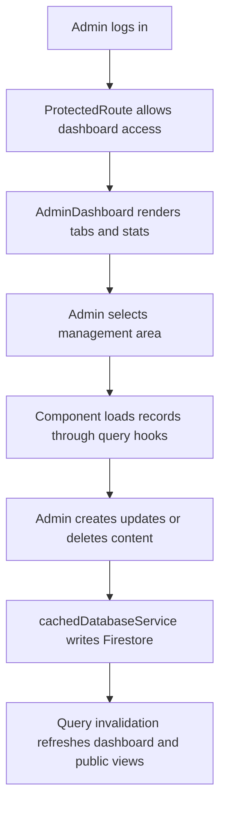

# Module 5 Admin Content Management

Version: 1.0
Date: 2026-03-09
Creator: GitHub Copilot
Reviewer: TBD
Organization: Educare Dada Chi Shala Educational Trust

## 1. Overview

Business purpose

This module gives internal staff a single operational workspace to manage the organization's digital content and records. It centralizes maintenance of team members, stories, blogs, gallery items, volunteers, branches, donations, and events.

What this module does

- Renders the admin dashboard shell and tabbed management experience.
- Provides CRUD interfaces for multiple content collections.
- Displays lightweight operational metrics.
- Uses protected routing and shared modal and form components.
- Invalidates query caches after successful mutations so public pages reflect current content.

When it runs

- On successful navigation to /admin/dashboard.
- Whenever an authenticated admin changes dashboard tabs.
- Whenever an admin opens a create or edit modal or submits a form.

## 2. Business and Process Detail

Business overview

The admin dashboard is the operational control center of the application. It is the common authenticated surface through which feature specific modules are maintained.

Process flow

Detailed journey

1. An authenticated admin enters the dashboard.
2. AdminDashboard.jsx loads sidebar tabs and summary counts.
3. The admin selects a tab such as Team, Stories, Blogs, Volunteers, Branches, Donations, Events, or Gallery.
4. The active management component loads records through React Query.
5. The admin opens create or edit dialogs, uploads media where needed, and submits changes.
6. Mutation hooks call cachedDatabaseService.js and update the related Firestore collection.
7. Query keys are invalidated so fresh data appears in both dashboard and public modules.

Functional requirements

- FR-AC-01: The system must provide a unified admin dashboard for authenticated users.
- FR-AC-02: The system must support CRUD operations for core content areas.
- FR-AC-03: The system must allow media and image management where required.
- FR-AC-04: The system must expose operational counts for dashboard context.
- FR-AC-05: The system must preserve basic admin usability on mobile.

Non functional requirements

- Dashboard access requires authenticated routing and backend enforced write rules.
- Admin flows should minimize repeated navigation with modals and tabbed sections.
- Shared controls should behave consistently across content types.
- Mutations should immediately invalidate related query keys.
- Volunteer assignment and donation approval workflows should remain traceable through data fields or history structures.

Technical breakdown

Dashboard shell

- src/pages/AdminDashboard.jsx

Tab components

- src/components/TeamManagement.jsx
- src/components/StoriesTestimonialsManagement.jsx
- src/components/BlogManagement.jsx
- src/components/VolunteerManagement.jsx
- src/components/BranchManagement.jsx
- src/components/DonationManagement.jsx
- src/components/EventManagement.jsx
- src/components/GalleryManagement.jsx

Modal and shared components

- src/components/gallery/GalleryFormModal.jsx
- src/components/team/TeamMemberFormModal.jsx
- src/components/stories/StoryTestimonialFormModal.jsx
- src/components/common/Modal.jsx
- src/components/common/Button.jsx
- src/components/common/LoadingSpinner.jsx
- src/components/ImageUpload.jsx

Supporting files

- src/hooks/useFirebaseQueries.js
- src/services/cachedDatabaseService.js
- src/services/imageUploadService.js
- src/context/AuthContext.jsx
- src/context/NotificationContext.jsx
- src/components/ProtectedRoute.jsx

Representative hooks and methods

- useEvents, useGalleryItems, useVolunteers
- CRUD hooks for blogs, team, stories, testimonials, branches, volunteers, events, gallery, and donations
- addBlog, updateBlog, deleteBlog
- addTeamMember, updateTeamMember, deleteTeamMember
- addGalleryItem, updateGalleryItem, deleteGalleryItem
- updateVolunteerStatus, assignVolunteerToBranch, updateDonationStatus

Security considerations

- Client side route protection exists, but backend authorization is still required.
- Admin actions should be backed by Firestore and Storage rules.
- Uploaded images and rich content must be validated.

Performance considerations

- The admin shell is lazy loaded.
- Per tab loading isolates query cost to the active management area.
- Stats may become more expensive as collections grow.
- Shared cache invalidation reduces stale UI but can trigger broad refetching if query keys are not scoped well.

## 3. Data and Automation

Managed data areas

- team
- successStories
- testimonials
- blogs
- gallery
- events
- branches
- volunteers
- donations
- donors for read and reporting through donation features

Records created

- Volunteer action_history entries within volunteer documents.
- Media references and image URLs associated with content records.
- No separate admin audit collection is visible in repository code.

## 4. Impacted Components

Direct files

- src/pages/AdminDashboard.jsx
- management components under src/components
- feature modals under src/components/gallery, src/components/team, and src/components/stories

Indirect files

- src/context/AuthContext.jsx
- src/context/NotificationContext.jsx
- src/components/ProtectedRoute.jsx
- src/hooks/useFirebaseQueries.js
- src/services/cachedDatabaseService.js
- src/services/imageUploadService.js
- src/services/emailService.js
- src/App.jsx

Impact notes

- Because this is a consolidation layer, changes here often affect public modules.
- Mutation contract changes in hooks or services affect one or more admin tabs.
- Sidebar structure and active tab logic control discoverability of all managed areas.
- Regressions in common modals or shared buttons can affect multiple workflows.

## 5. Admin and Technical Notes

Configuration requirements

- Firebase Auth must be enabled and admin credentials must exist.
- Firestore and Storage rules must support authorized admin operations.
- Any EmailJS or function backed workflows used by management tabs must be configured.

Permissions needed

- Authenticated admin access to the dashboard route.
- Write access to all managed content collections.
- Storage write access for media uploads.

Debug queries

- team orderBy order asc
- blogs orderBy created_at desc
- gallery orderBy uploaded_at desc
- volunteers orderBy submitted_at desc
- donors orderBy createdAt desc

Common issues

- Admin tab loads but data is blank because of permissions or missing indexes.
- Image upload completes but the returned URL is not stored correctly.
- Status updates appear stale until invalidation and refetch complete.
- Dashboard access works for authenticated users who may not actually be intended admins if backend rules are weak.

Troubleshooting

1. Confirm the admin user is authenticated and routed through ProtectedRoute.
2. Check the relevant collection documents directly in Firestore.
3. Validate image upload success and stored file URLs.
4. Inspect React Query invalidation behavior after save operations.
5. Review backend rules if writes succeed or fail unexpectedly.
