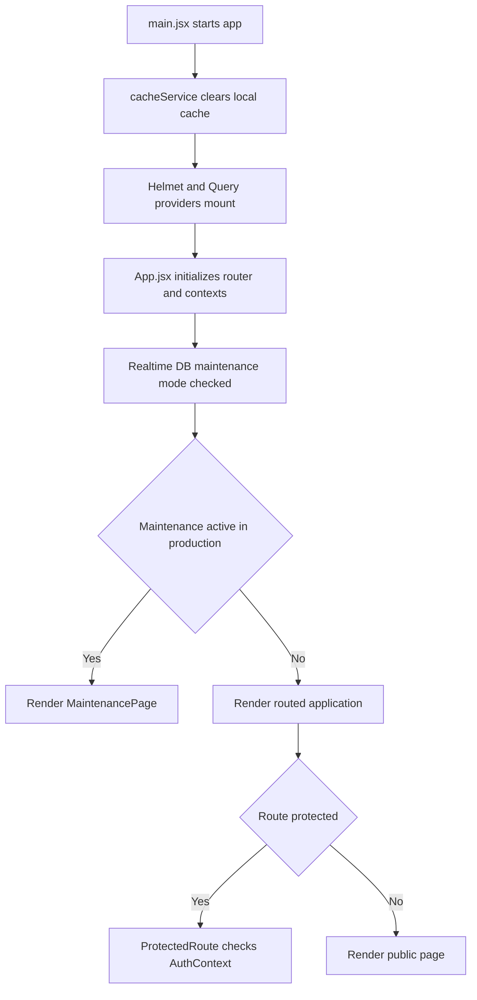

# Module 6 Platform Infrastructure Authentication and Shared Services

Version: 1.0
Date: 2026-03-09
Creator: GitHub Copilot
Reviewer: TBD
Organization: Educare Dada Chi Shala Educational Trust

## 1. Overview

Business purpose

This module is the platform foundation of the application. It handles startup behavior, routing, authentication, maintenance mode, shared providers, query behavior, Firebase initialization, and deployment configuration.

What this module does

- Boots the React application and mounts global providers.
- Initializes Firebase services and validates environment configuration.
- Defines the public and admin route map.
- Protects admin routes through authenticated navigation.
- Applies query defaults, caching behavior, SEO support, notification behavior, and error handling.
- Supports a Realtime Database maintenance mode toggle for production shutdown control.

When it runs

- Immediately on application startup.
- On every route navigation.
- On every authentication state change.
- On browser refresh when cache cleanup and provider initialization run.

## 2. Business and Process Detail

Business overview

This module is not directly user facing in business terms, but it is the operational backbone that keeps all user facing modules available, secure, and maintainable.

Process flow

Detailed journey

1. main.jsx clears namespaced cache state to prevent stale data after full reload.
2. The app mounts HelmetProvider and QueryProvider.
3. App.jsx wraps the UI with AuthProvider and NotificationProvider.
4. App.jsx reads config/maintenanceMode from Realtime Database.
5. If maintenance mode is true in production, the app serves MaintenancePage instead of normal routes.
6. Otherwise the router resolves the requested page, which is lazy loaded through React.lazy and Suspense.
7. For admin dashboard routes, ProtectedRoute.jsx checks useAuth() state.
8. AuthContext.jsx maintains user state using Firebase Auth and onAuthStateChanged().
9. Shared query configuration, logging, SEO, notification display, and scroll reset continue across route changes.

Functional requirements

- FR-PI-01: The system must initialize the app with global providers in the required order.
- FR-PI-02: The system must expose the defined public and admin route map.
- FR-PI-03: The system must restrict /admin/dashboard to authenticated users.
- FR-PI-04: The system must support a production maintenance switch through config/maintenanceMode.
- FR-PI-05: The system must initialize Firebase services from environment variables and log missing values clearly.

Non functional requirements

- The app should fail gracefully when analytics or maintenance reads fail.
- Auth, environment variables, and route guarding must prevent accidental admin exposure.
- Initialization errors must be visible in browser logs.
- Route level code splitting should keep startup lean.
- Shared services should provide one clear place to adjust cache, query, and auth behavior.

Technical breakdown

Startup and routing files

- src/main.jsx
- src/App.jsx

Authentication and protection files

- src/context/AuthContext.jsx
- src/components/ProtectedRoute.jsx
- src/pages/AdminLogin.jsx

Shared shell and utility files

- src/components/Navbar.jsx
- src/components/Footer.jsx
- src/components/ScrollToTop.jsx
- src/components/ErrorBoundary.jsx
- src/components/SEO.jsx
- src/context/NotificationContext.jsx

Config and service files

- src/services/firebase.js
- src/config/queryClient.jsx
- src/services/cacheService.js
- src/utils/adminSetup.js
- src/utils/logger.js
- src/utils/helpers.js
- src/utils/validators.js
- src/utils/sanitization.js
- src/config/colors.js

Build and deployment files

- package.json
- vite.config.js
- tailwind.config.js
- postcss.config.cjs
- firebase.json
- vercel.json

Important exports

- AuthProvider and useAuth()
- QueryProvider and queryClient
- Firebase exports db, rtdb, auth, storage, functions, analytics
- showNotification, showSuccess, showError, showWarning, showInfo

Security considerations

- Missing or weak Firestore rules are the main systemic risk.
- ProtectedRoute is necessary but not sufficient for backend authorization.
- Environment variables must not leak secrets beyond intended public keys.
- The Realtime Database maintenance path should be writable only by trusted operators.

Performance considerations

- Lazy loaded routes reduce initial bundle size.
- Query defaults enable controlled retry and refetch behavior.
- Cache clearing on hard refresh improves freshness but reduces persistence benefits.
- Notification rendering is lightweight.

## 3. Data and Automation

Platform operations

- Read config/maintenanceMode from Realtime Database.
- Subscribe to Firebase Auth state.
- Initialize Firestore, Storage, Functions, and Analytics clients.
- Clear app managed local cache on startup.

Primary platform areas

- Realtime Database path config/maintenanceMode
- Firebase Auth
- Firestore
- Storage
- Cloud Functions
- Analytics

Records created

- No business child records are created directly by startup logic.
- Authentication sessions and browser cache entries are managed implicitly by SDKs and cacheService.

## 4. Impacted Components

Direct files

- src/main.jsx
- src/App.jsx
- src/context/AuthContext.jsx
- src/context/NotificationContext.jsx
- src/components/ProtectedRoute.jsx
- src/components/ErrorBoundary.jsx
- src/components/ScrollToTop.jsx
- src/components/Navbar.jsx
- src/components/Footer.jsx
- src/services/firebase.js
- src/config/queryClient.jsx
- src/services/cacheService.js

Indirect files

- all src/pages files through routing
- all src/hooks files through query configuration
- all src/services files through Firebase client initialization
- root build and hosting configuration files

Impact notes

- Changes in App.jsx or main.jsx affect the entire site.
- Query client changes alter fetch behavior across all modules.
- Firebase bootstrap changes can break every data dependent feature.
- Weak route protection or auth state logic can expose or block admin areas globally.

## 5. Admin and Technical Notes

Configuration requirements

- .env must include all required Firebase variables referenced in src/services/firebase.js.
- Realtime Database must contain a readable config/maintenanceMode path if maintenance control is used.
- Auth providers and admin accounts must be configured in Firebase Auth.
- Hosting configuration in firebase.json and vercel.json must preserve SPA routing.

Permissions needed

- App runtime needs public Firebase initialization access.
- Admin users need Firebase Auth credentials.
- Only trusted operators should be able to change maintenance mode.

Debug checks

- Realtime Database read on config/maintenanceMode.
- Firebase Auth current user state inspection.

Common issues

- Missing Firebase environment variables causing startup instability.
- Admin route redirect loops caused by auth state not resolving.
- Entire site showing the maintenance page because maintenanceMode is enabled in production.
- Stale data confusion because cache is cleared only on hard refresh.

Troubleshooting

1. Confirm all required VITE_FIREBASE variables are present.
2. Verify Firebase Auth can sign in and restore sessions on refresh.
3. Check the Realtime Database value under config/maintenanceMode.
4. Validate that hosting rewrites still point unknown routes to index.html.
5. Inspect browser console initialization, auth, and query errors before troubleshooting feature modules.
